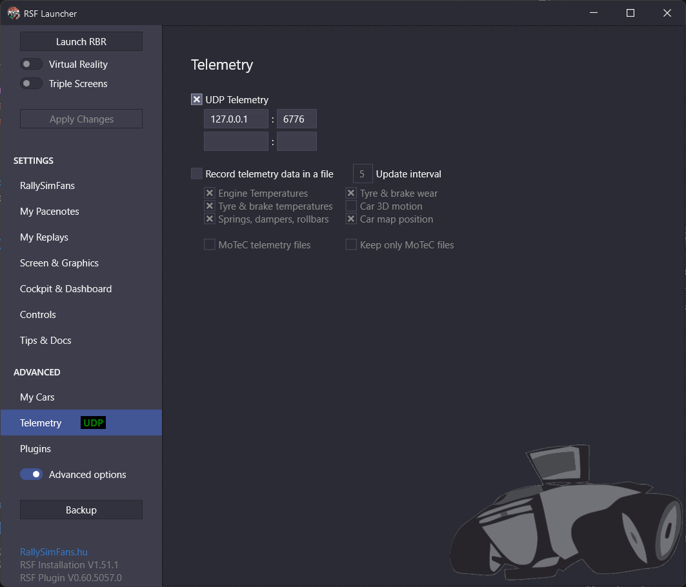

The Logitech G29 racing wheel contains a small array of LEDs in the center that is used to indicate the engine's current RPM when it is close to the maximum and gives an indication when to shift. Support for these LEDs generally depends on the application. Many recent racing games have built-in support for the LEDs, while older have not (the hardware wasn't available back then after all). While there are some generic approaches to drive the LEDs for custom applications (such as [Fanaleds](www.fanaleds.com)), the issue is mostly that the support for a particular game varies or requires a lot of configuration.

As different cars have different RPM ranges, maxium RPM and shift points, it's also not possible to uniformly derive the state of the LEDs for a given value. Racing games often provide real-time telemetry by exposing the data via UDP which can be used by external hard- or software to display or record data.

Since Richard Burns Rally (RBR) is 19 years old by this time, support for modern hardware is lacking. The G29 itself is supported, but not the LEDs. Which is why I have written [RBR2G29](https://github.com/lennartb-/RBR2G29), a small Rust application that controls the LEDs with data coming from RBRs telemetry. The application is a fork of [DR2G27](https://github.com/Andris0/DR2G27), a similar application for the G27 wheel and Dirt Rally 2. RBR is kept alive by a large community, notably the [RallySimFans-Plugin (RSF)](https://www.rallysimfans.hu/rbr/index.php), which improves the physics, adds additional cars and stages among other things like bugfixes and QOL improvements.

## Controlling the LEDs

Interfacing with the G29 is moderately difficult. Logitech provides an SDK for C/C++ and bindings for C#, which is however more geared towards applications that use the wheel itself. The C# bindings don't officially support alternate window handles, which means you are stuck to your application window - as soon as your window goes out of focus, no commands are sent to the wheel anymore. Since this application runs in the background of the main program (RBR), communication via the C# SDK doesn't seem to be viable anyway.

Another option is to adress the device directly on a low level via HID. It was surprisingly easy to find the necessary bytes for this: in the [Linux kernel source](https://github.com/torvalds/linux/blob/master/drivers/hid/hid-lg4ff.c#L1088).

To update the LED state of the wheel, an array of unsigned 8 bit integer values (`u8`) is send to the device. The fourth element controls which LEDs light up.

```rust
const fn led_state_payload(state: u8) -> [u8; 8] {
        [0x00, 0xF8, 0x12, state, 0x00, 0x00, 0x00, 0x01]
    }
```

The wheel has 10 LEDs, which are lit in pairs of two symetrically. This means there can be 5 different LED states, so for every 20% of the RPM range, one further LED pair is lit up:

```rust
fn percentage_to_led_state(percentage: u8) -> u8 {
        match percentage {
            MIN..=20 => 1,
            21..=40 => 3,
            41..=60 => 7,
            61..=80 => 15,
            81..=MAX => 31,
        }
    }
```

Since the LED hardware of semi-recent Logitech wheel is similar enough, the application also supports the G27 and G920 wheels. Adding support for a new wheel is as easy as detecting the PID of a supported device, as long as above HID access remains the same.

### Flashing the LEDs

One common feature of wheels in racing cars is that the wheel's LED bar will flash on the optimal shift point or when the maximum RPM are reached. Since the RPM number is not fully constant, but fluctuates within a certain range, just checking whether the RPMs stay the same over a period of time won't work. Instead, on every telemetry tick it is checked if the current LED state equals the maximum number of enabled lights (i.e. the engine is on or close to the maximum) and whether the RPM from the previous tick differs by less than 100 (which seems like a reasonable amount to account for the fluctuations). If this is the case, a counter gets incremented by one. On the next tick, it is checked whether the counter is above a certain threshold (60 ticks seem like a good number) and the LEDs are temporarily turned of until the the counter reaches the threshold again. This results in the LEDs flashing a couple of times per second - slow enough that on/off is clearly discernable, but fast enough to recognize it from the corner of the eye.

## Communicating with RBR

There are two sources of data needed to calculate the current RPM values for the LEDs: The realtime telemetry data and the RPM ranges for the current car.

The realtime telemetry is exposed through a UDP socket. The data received is a byte array, which can be deserialized into a more suitable data structure to make the values easier to access. The initially mentioned RSF plugin ships with a C-header file that defines the data structures the received bytes represent. I left the job of converting the data structures to Rust to Copilot, which went surprisingly well - I had to make no structural changes (except updating member names). The deserialization itself is done with [Serde](https://serde.rs/).

The telemetry structure contains the required realtime data: The current gear, the engine RPM and a couple of other information needed, such as the ID of the car or elapsed time of a stage.

The optimal shifting revs are stored in a `common.lsp` file in the sub-folder for each car. The `.lsp` extension already indicates it: the data is indeed stored in a Lisp-like format. Although I know basically nothing about programming Lisp, grabbing the values from the file is fortunately easy and doesn't require specific parsing, since it's enough to just read the lines starting with `gear0upshift`, `gear0downshift` etc. and the overall `RPMLimit`, and get the value from each line. All values are put into a simple `GearMap` struct to easily access the values later.

On each telemetry tick it is checked whether the car or stage has changed, and a new `GearMap` is build. In any case the currently set gear is updated to have the current upshift RPM for the LED controlling logic.

## RBR Configuration

UDP telemetry must be enabled in the RSF launcher. RBR2G29 defaults to `127.0.0.1:6776`, but can be started with the `-i --ip <IP>` and `-p --port <PORT>` arguments to use different values.

 "Image showing RSF Launcher UDP telemetry page with predefined settings 127.0.0.1:6776")

I've created a short video to showcase the result

https://www.youtube.com/watch?v=hgMVkIjgzb8