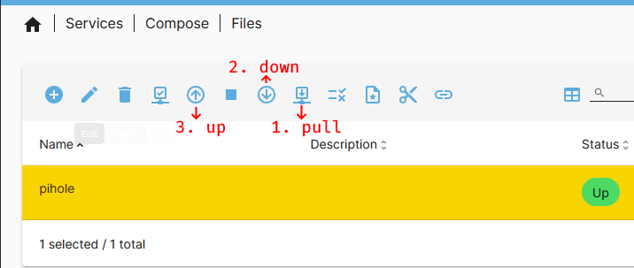

Since the Pi-hole Docker image [should not be upgraded](https://github.com/pi-hole/docker-pi-hole#upgrading--reconfiguring) the same way as a physical instance (using `pihole -up`), the container for each new release has to be rebuild. It's surprisingly hard to find up-to-date information on how to update the image when running Pi-hole on top of an OpenMediaVault instance. Most available information is already a couple of years old, and often refers to using additional plugins (Watchtower) or still applies to the outdated Portainer variant.

It's actually pretty simple: First, navigate to "Services"-"Compose"-"Files" in the OMV web UI. Then, selecting the "pull" button gets the latest container version from the registry. This can take a couple of minutes. Afterwards, the container needs to be taken down using the "down" button and started again using "up".

Assuming the container has been [configured with volumes to store the user data](https://github.com/pi-hole/docker-pi-hole#quick-start), no configuration data is lost - it's an inplace upgrade just like using `pihole-up`.